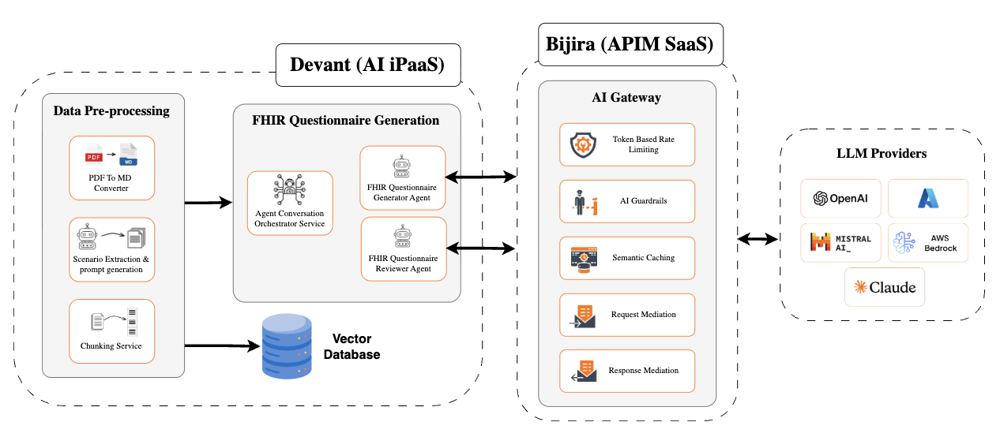

# FHIR Questionnaire Generation

The **FHIR Questionnaire Generation** project provides a fully automated pipeline to transform **payer policy documents** into standardized **FHIR Questionnaire resources** using a combination of AI agents, data preprocessing, and orchestration services.
It addresses the growing need for **interoperable and automated questionnaire generation** as required by modern healthcare data exchange standards such as the **CMS Final Rule**.

---

## Problem

Insurance payers typically distribute policy and plan details as static **PDF documents**, which must be manually reviewed by domain experts to assess **patient coverage eligibility**.
When a patient qualifies, further validation requires practitioners to answer a set of questions — questions that should ideally be delivered as **FHIR Questionnaire resources**.

However, most payers lack a standardized mechanism to generate these FHIR Questionnaires automatically. They still rely on **manual processes** such as emails, phone calls, or fax, creating inefficiencies and inconsistencies in care delivery.

With the **CMS Interoperability and Prior Authorization Final Rule**, payers are now required to provide **FHIR-based endpoints** that support automated and digital exchange of such questionnaires — paving the way for this system.

---

## Solution

This project provides a fully automated pipeline that **transforms payer policy documents into standardized FHIR Questionnaire resources**. By integrating advanced text processing, scenario extraction, and collaborative AI agents, it streamlines the workflow and ensures compliance with healthcare interoperability standards like the CMS Final Rule.

The architecture is based on a modular microservice design, where each service manages a distinct phase of the transformation process while ensuring seamless integration across the system.

Below is the deployment diagram of the overall architecture:



---

## Project Modules

### `/data_ingestion_pipeline`

Contains services responsible for preprocessing raw payer documents and extracting contextual scenarios.

#### **1. /policy_preprocessor**

* Handles **PDF uploads**, **conversion to Markdown**, and **chunking** of text data.
* Provides centralized APIs for document processing and communication with downstream services.

#### **2. /pdf_to_md_service**

* Converts uploaded **PDF documents** into **Markdown (MD)** format using [Docling](https://docling-project.github.io/docling/).
* Uploads converted files to the FTP server for chunking.

#### **3. /template_generation_service**

* Uses AI-driven extraction logic to identify and structure **scenarios** from policy document chunks.
* Ingests supplementary information from a vector database to ensure contextual accuracy.

---

### `/fhir_questionnaire_generation`

Contains the main services responsible for generating and reviewing **FHIR Questionnaire resources** based on extracted scenarios.

#### **1. /fhir_questionnaire_orchestration**

* Listens for extracted scenario data in `/prompts` and triggers the **Generator Agent**.
* Manages structured interactions between the **Generator** and **Reviewer Agents** to ensure quality.
* Posts the final validated questionnaires to the **Policy Processor** service.

#### **2. /fhir_questionnaire_generator_agent**

* Generates FHIR Questionnaires from user input and templates using AI models.

#### **3. /fhir_questionnaire_reviewer_agent**

* Reviews and validates generated questionnaires for correctness and adherence to standards.

---

## Setup

1. **Clone** the repository:

   ```bash
   git clone <repository_url>
   ```
2. **Setup the FTP server**:

   Have the FTP server running locally or remotely to facilitate file storage and access between services.

3. **Setup & configuration**: 
    Follow the instructions in the REAMDE files of each module to install dependencies and configure environment variables.

4. **Service Startup Sequence**:

    **Step 1: Data Ingestion & Preprocessing**

    - 1.1. `policy_preprocessor`: Prepares and chunks policy documents.
    - 1.2. `pdf_to_md_service`: Converts PDFs to Markdown format.
    - 1.3. `template_generation_service`: Extracts scenarios and structures data.

    **Step 2: Questionnaire Generation & Orchestration**

    - 2.1. `fhir_questionnaire_generator_agent`: Generates FHIR Questionnaires.
    - 2.2. `fhir_questionnaire_reviewer_agent`: Reviews and validates questionnaires.
    - 2.3. `fhir_questionnaire_orchestration`: Coordinates agent interactions and finalizes output.
